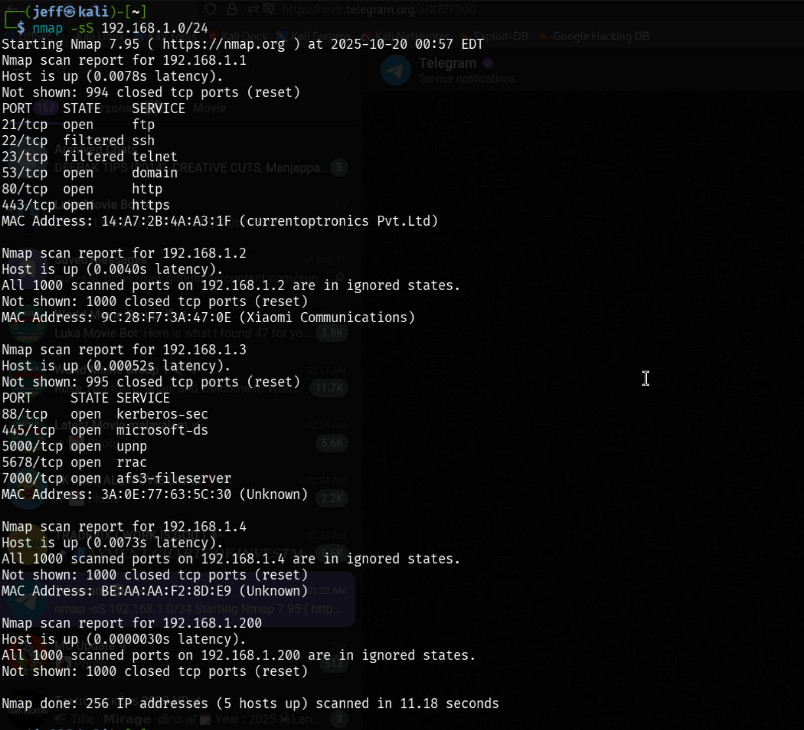
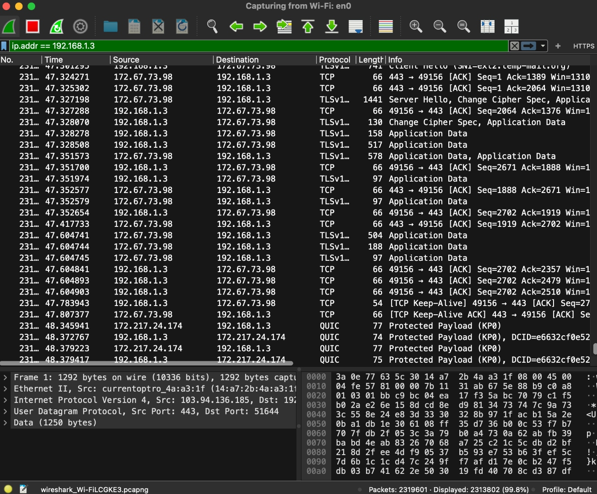

# Cybersecurity Portscan Project
This repository contains the results of a network reconnaissance and port scan conducted on a local network using Nmap.
## Project Workflow and Results
The following screenshots illustrate the network portscan analysis process and results:
### Network Portscan Workflow

This screenshot demonstrates the command-line execution of the Nmap network scan, showing the scanning process and initial discovery of devices on the 192.168.1.0/24 subnet. It captures the real-time output as Nmap performs host discovery and port enumeration across the local network.
### Portscan Analysis Results

This screenshot displays the comprehensive results of the network portscan, including detailed information about discovered hosts, open ports, running services, and service versions. The formatted output provides a clear view of the network topology and potential security assessment findings.
## File List
- `Network_portscan_report.html` — Formatted Nmap scan results, including open port and service enumeration for all detected devices on the `192.168.1.0/24` subnet.
## How to View
Download and open the HTML file in any web browser to view the scan results in table format.
## Methodology
The scan was performed using a TCP SYN scan (`nmap -sS`). Full methodology and analysis are available in the project documentation.
## Author
Jefrine Correya
